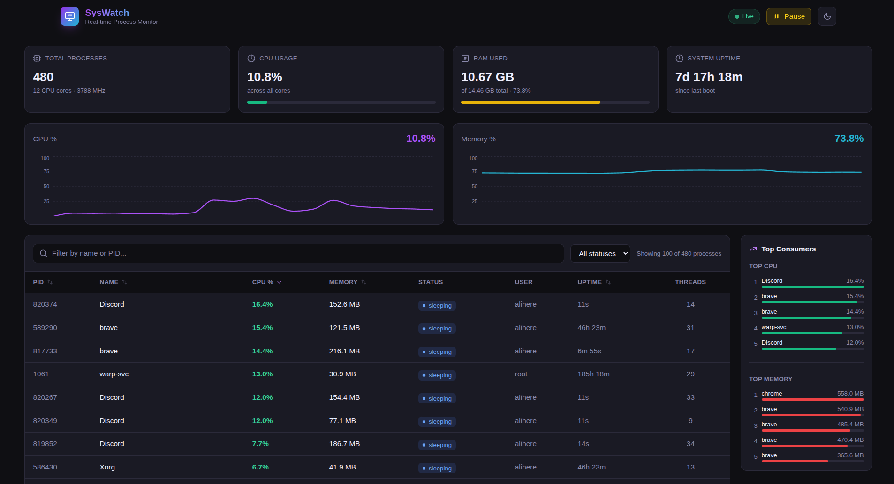
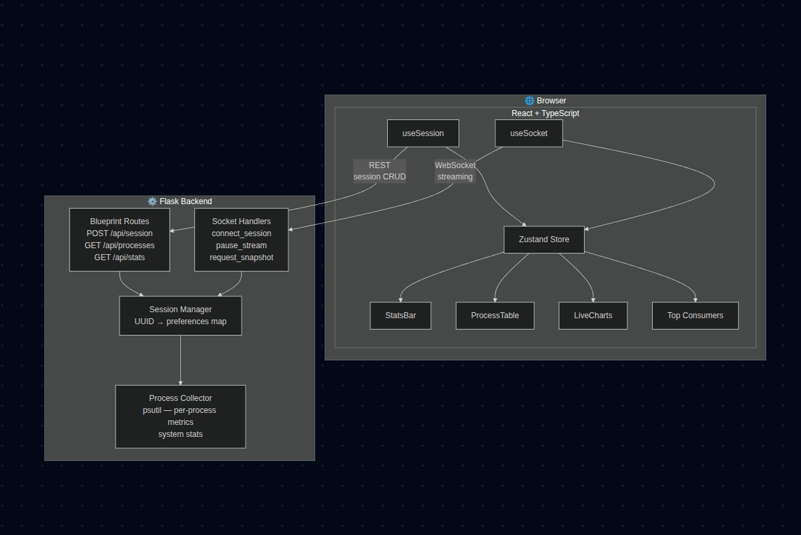
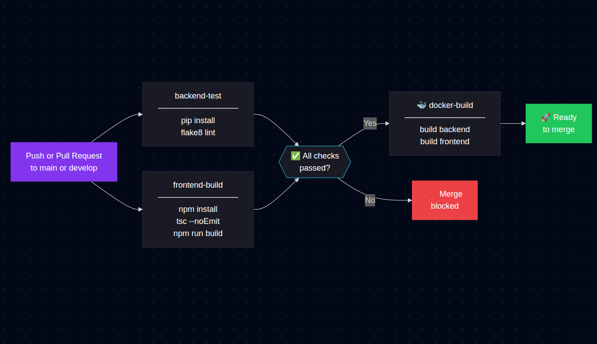

# SysWatch


A production-grade, real-time system process monitor with a modern web dashboard. Every connected client gets an isolated session that streams live CPU metrics, memory usage, and the full process table directly from the OS — no polling, no page refreshes, no shared state between users.



---

## How It Works

SysWatch is built around a **clean separation between two transport layers**. REST handles session lifecycle and one-shot snapshots. WebSockets handle everything that changes over time.



### Data pipeline

`psutil` reads raw OS metrics → `process_collector.py` normalises them into typed dicts → `socket_handlers.py` emits `process_update` over a **per-client eventlet greenthread** every 2 seconds → the Socket.IO client receives the payload → `useSocket` writes to the **Zustand store** → `ProcessTable`, `StatsBar`, and `LiveCharts` re-render with the latest data — no intermediate REST round-trip, no debounce hack, no shared mutable state across clients.

### Session isolation

When a tab loads, `useSession` checks `localStorage` for an existing session ID and validates it against `GET /api/session/:id`. If the session is missing or expired, a new UUID is created via `POST /api/session`. This session ID is the key that links a browser tab to a dedicated backend greenthread. **No two clients ever receive each other's data.** Each session carries its own filter text, sort preferences, and pause state — changes in one tab have zero effect on any other.

The pause/resume control sends a `pause_stream` socket event that flips a flag on the session's preferences object. The greenthread checks this flag on every tick and skips the emit without killing the connection, so resuming is instant.

---

## Features

| Feature | Detail |
|--------|--------|
| **Real-time streaming** | WebSocket pushes full process list + system stats every 2 s |
| **Session isolation** | Each tab has a UUID session; greenthreads never share state |
| **Pause / resume** | Freeze the stream without dropping the WebSocket connection |
| **Live rolling charts** | 60-point CPU % and Memory % line charts via Recharts |
| **Sortable columns** | Click any header to sort; click again to reverse direction |
| **Filter by name or PID** | Instant client-side filtering with zero re-fetches |
| **Status filter** | Dropdown scoped to running / sleeping / stopped / zombie |
| **Process detail panel** | Click any row — animated slide-in panel with full process info |
| **Top consumers sidebar** | Ranked top-5 CPU and top-5 memory with inline bar charts |
| **Dark / light / system theme** | Three-way toggle, persisted in `localStorage` |
| **Responsive layout** | Sidebar collapses on mobile, table scrolls horizontally |

---

##    Decisions

**Why eventlet greenthreads instead of background threads?**
Flask-SocketIO in eventlet mode uses cooperative multitasking. Each `eventlet.spawn()` call is lightweight and shares the same OS thread. Spawning one per connected client scales far better than OS threads and integrates cleanly with Flask's request context.

**Why Zustand instead of Redux or Context?**
Zustand keeps the store co-located with its derived state logic. The `applyFiltersAndSort` function runs inside every action that changes data or preferences, so filtered/sorted output is always consistent without selectors or memoisation boilerplate.

**Why separate REST and WebSocket concerns?**
REST endpoints handle idempotent, request/response operations (create session, get session, one-shot snapshot). WebSockets handle streaming. This separation means the REST layer is independently testable and the WebSocket layer has no CRUD responsibilities.

---

## Local Development

### Prerequisites

- Python 3.11+
- Node.js 18+
- Git

### Backend

```bash
cd backend

python -m venv venv
source venv/bin/activate      # Windows: venv\Scripts\activate

pip install -r requirements.txt
python app.py
```

The API and WebSocket server starts at **http://localhost:5000**.

To verify it's working, open a second terminal and run:

```bash
curl -s -X POST http://localhost:5000/api/session | python3 -m json.tool
```

You should see a session object with a `session_id` UUID.

### Frontend

```bash
cd frontend

cp ../.env.example .env      # sets VITE_BACKEND_URL=http://localhost:5000
npm install
npm run dev
```

The dev server starts at **http://localhost:3000** with hot module replacement enabled.

### Running both together

Open two terminals side by side — one for the backend, one for the frontend. The frontend Vite dev server proxies nothing; it connects directly to the Flask backend via the `VITE_BACKEND_URL` environment variable.

---

## Docker

The fastest way to get a full production build running locally:

```bash
cp .env.example .env
docker compose up --build
```

| Service  | URL                    | Notes                          |
|----------|------------------------|--------------------------------|
| Frontend | http://localhost:80    | nginx, serves built Vite dist  |
| Backend  | http://localhost:5000  | gunicorn + eventlet worker     |

The nginx config proxies `/api/` and `/socket.io/` to the backend container, so the frontend only needs to know about port 80 in production.

To rebuild only one service after a code change:

```bash
docker compose up --build backend   # or frontend
```

---

## Environment Variables

| Variable           | Default                 | Required | Description                              |
|--------------------|-------------------------|----------|------------------------------------------|
| `VITE_BACKEND_URL` | `http://localhost:5000` | Frontend | WebSocket + REST base URL for the client |
| `FLASK_ENV`        | `development`           | Backend  | Controls Flask debug mode and behaviour  |

---

## CI/CD Pipeline



---

## License

MIT — see [LICENSE](LICENSE) for details.
